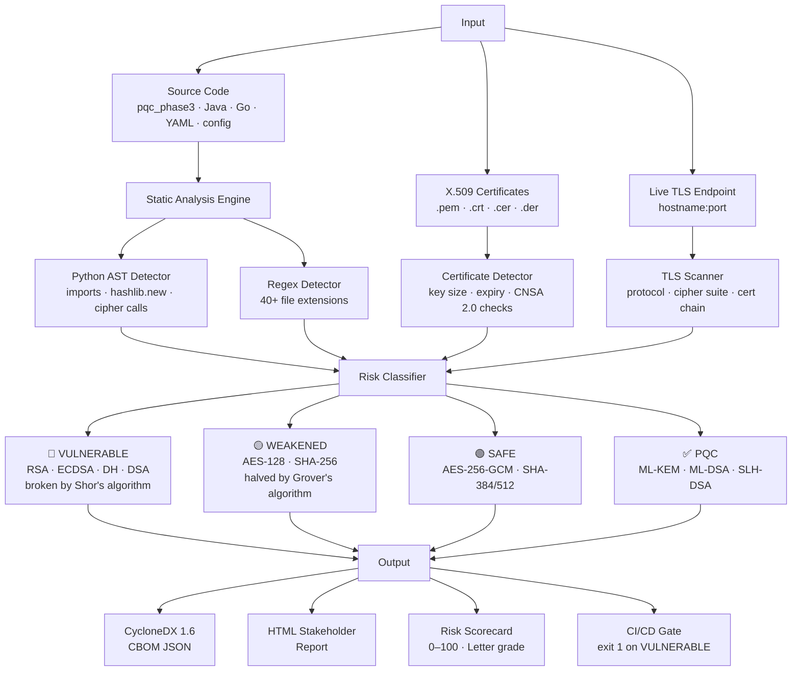
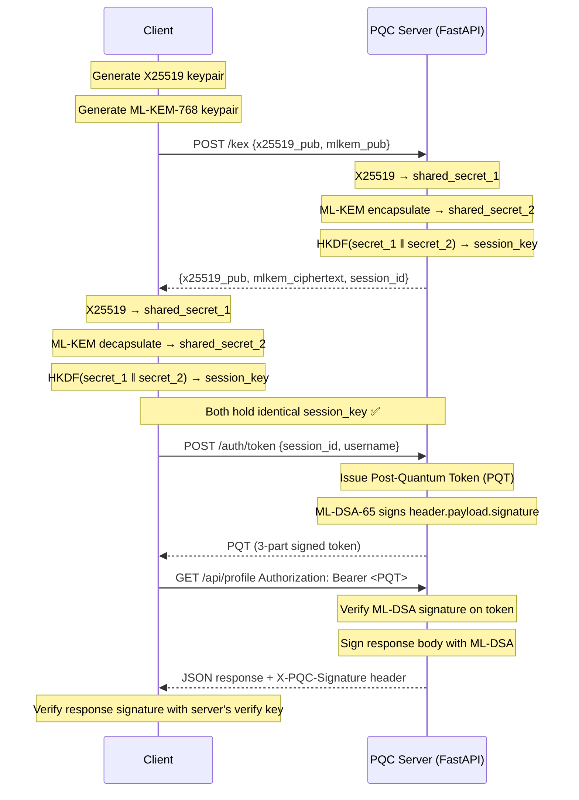

# PQC Learning Lab + CBOM Scanner

A self-study project for learning post-quantum cryptography hands-on —
implementing the NIST PQC standards (FIPS 203/204/205) in a real FastAPI
service and building a Cryptographic Bill of Materials (CBOM) scanner that
inventories cryptographic assets across codebases, classifies quantum risk,
and outputs CycloneDX 1.6 CBOM JSON for compliance reporting.

---

## Repository map

```
pqc_phase3/         NIST PQC algorithm demos (ML-KEM, ML-DSA, SLH-DSA via liboqs)
pqc_phase4/         FastAPI PQC service — hybrid KEM, PQT tokens, signed responses
cbom_scanner/       Cryptographic Bill of Materials scanner (CycloneDX 1.6 output)
sample_client/      Fictional pre-migration banking API — used as portfolio demo target
```

---

## CBOM Scanner — portfolio centrepiece

The scanner directly demonstrates the core skill of a Cryptographic Inventory Analyst:
automated discovery of all cryptographic assets, quantum risk classification, and
machine-readable CBOM output for stakeholders and compliance teams.

### Scanner architecture



### Quick start

```bash
# Scan source code
PYTHONPATH=. python3 -m cbom_scanner.cli pqc_phase4

# Scan a live TLS endpoint
PYTHONPATH=. python3 -m cbom_scanner.cli --tls github.com

# Combined: source + endpoint
PYTHONPATH=. python3 -m cbom_scanner.cli src/ --tls api.example.com

# CycloneDX 1.6 JSON output
PYTHONPATH=. python3 -m cbom_scanner.cli . --format cyclonedx --output cbom.json

# HTML stakeholder report
PYTHONPATH=. python3 -m cbom_scanner.cli . --format html --output report.html

# CI gate — exits 1 if quantum-vulnerable crypto found
PYTHONPATH=. python3 -m cbom_scanner.cli src/ --min-risk vulnerable
```

### What it detects

| Category | Examples |
|---|---|
| **Quantum-vulnerable** 🔴 | RSA, ECDSA, ECDH, DH, DSA, MD5, 3DES, RC4, TLS 1.0/1.1 |
| **Quantum-weakened** 🟡 | AES-128, SHA-256, TLS 1.2/1.3 without ML-KEM hybrid |
| **Quantum-safe** 🟢 | AES-256-GCM, ChaCha20-Poly1305, SHA-384/512 |
| **NIST PQC** ✅ | ML-KEM (FIPS 203), ML-DSA (FIPS 204), SLH-DSA (FIPS 205) |
| **TLS endpoint** | Protocol, cipher suite, certificate algorithm, CNSA 2.0 checks |
| **X.509 certificates** | Key algorithm, key size, expiry, SHA-1 signatures, post-2030 validity |

### Output formats

| Format | Use case |
|---|---|
| `--format table` | Terminal — developer / analyst workflow |
| `--format cyclonedx` | Machine-readable CycloneDX 1.6 CBOM JSON — SBOM tooling, dashboards |
| `--format html` | Stakeholder report — self-contained, open in any browser |

---

## Sample engagement report

`sample_client/` is a fictional pre-migration banking API (AcmeCorp) built to
represent the state of most enterprise systems before PQC transition — RSA JWTs,
ECDSA transaction signing, AES-128-CBC, 3DES legacy fields, RC4, and RSA-2048 certs.

**Scan results: 67 cryptographic components — Risk score 0/100 (F — Critically Vulnerable)**

| Finding | Count |
|---|---|
| 🔴 Vulnerable | 115 |
| 🟡 Weakened | 52 |
| 🟢 Safe / PQC | 69 |

**Top migration priorities identified:**
1. RSA-2048 JWT signing → ML-DSA-65 (FIPS 204) Post-Quantum Tokens
2. ECDSA P-256 transaction signing → ML-DSA-65 (10-year archive at retroactive risk)
3. AES-128-CBC PII encryption → AES-256-GCM (authenticated + quantum-safe)
4. 3DES / RC4 legacy fields → AES-256-GCM (classically broken — immediate action)
5. TLS 1.1/1.2 → TLS 1.3 + X25519MLKEM768 hybrid cipher suite
6. RSA-2048 certificates → Reissue with ML-DSA-65 before CNSA 2.0 deadline (2030)

To view the HTML report: open `sample_client/cbom_report.html` in a browser.
CycloneDX JSON: `sample_client/cbom.json`

---

## Phase 3 — NIST PQC algorithm demos

```bash
PYTHONPATH=. python3 pqc_phase3/run_all.py
```

Covers: ML-KEM (FIPS 203), ML-DSA (FIPS 204), SLH-DSA (FIPS 205) — keygen,
encaps/decaps, sign/verify, benchmarks, and parameter set comparison.

---

## Phase 4 — FastAPI PQC service

### Key exchange + authentication flow



```bash
# Start server
python3 -m uvicorn pqc_phase4.server:app --host 0.0.0.0 --port 8000

# Run full 8-step demo
PYTHONPATH=. python3 pqc_phase4/client_demo.py
```

Endpoints:
- `POST /kex` — hybrid X25519 + ML-KEM-768 key exchange
- `POST /auth/token` — Post-Quantum Token (ML-DSA-65 signed)
- `GET /api/*` — ML-DSA signed protected responses
- `GET /.well-known/pqc-keys` — verify key distribution (JWKS-like)
- `GET /algorithms` — crypto-agility: active algorithms + all available

---

## Stack

- Python 3.11+, FastAPI, uvicorn, liboqs-python (Open Quantum Safe)
- NIST standards: FIPS 203 (ML-KEM), FIPS 204 (ML-DSA), FIPS 205 (SLH-DSA)
- CBOM standard: CycloneDX 1.6
- Compliance reference: NSA CNSA 2.0, NIST SP 800-131A Rev 2
