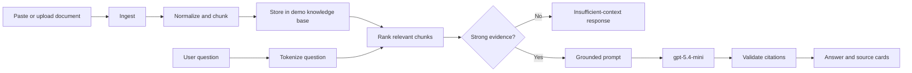

# Grounded Docs

Grounded Docs is a minimal document question-answering application that
demonstrates the core mechanics of **retrieval-augmented generation (RAG)**.

Users can paste text or upload a `.txt`/`.md` file, index it as a document, ask
a question, and receive an answer generated from retrieved document chunks.
Answers include source excerpts and verifiable `[Source N]` citations.

## RAG pipeline



The interface also shows the flow as:

```text
Ingest → Chunk → Retrieve → Generate → Cite
```

## Features

- Paste text or upload `.txt` and `.md` files
- Normalize and split documents into searchable chunks
- Deterministic lexical retrieval without vector infrastructure
- Grounded answer generation using `gpt-5.4-mini`
- Source excerpts, retrieval scores, and citation validation
- Explicit insufficient-context responses
- Basic request validation and question rate limiting
- Typed OpenAPI contract with generated React Query hooks and Zod schemas
- Responsive React/Vite interface with loading, empty, and error states

## Architecture

```text
React/Vite frontend
        │
        │ typed generated client
        ▼
Express API server
        │
        ├── document ingestion and chunking
        ├── deterministic lexical retrieval
        ├── grounded prompt construction
        ├── citation validation
        └── Replit-managed OpenAI integration
```

## Repository structure

```text
artifacts/grounded-docs/
├── src/components/knowledge-base.tsx  # upload, form, document list, summary
├── src/components/qa-workspace.tsx    # questions, answers, source cards
├── src/pages/home.tsx                 # application shell
└── src/index.css                      # visual theme

artifacts/api-server/src/routes/knowledge.ts
                                      # ingestion, retrieval, and LLM route

lib/api-spec/openapi.yaml              # API source of truth
lib/api-client-react/                  # generated React Query client
lib/api-zod/                           # generated request/response schemas
lib/integrations-openai-ai-server/     # managed OpenAI SDK wrapper
```

## Requirements

- Node.js
- pnpm
- A Replit-managed OpenAI integration

The server expects these managed environment values:

```text
AI_INTEGRATIONS_OPENAI_API_KEY
AI_INTEGRATIONS_OPENAI_BASE_URL
```

Provision them through Replit AI Integrations. Never put API keys in frontend
code or commit them to the repository.

## Run in Replit

The workspace includes these workflows:

```text
artifacts/api-server: API Server
artifacts/grounded-docs: web
```

The web application is served at:

```text
/grounded-docs/
```

The frontend calls the shared API through the artifact-aware `/api` path.

## Run locally

Install dependencies from the repository root:

```bash
pnpm install
```

Start the API:

```bash
pnpm --filter @workspace/api-server run dev
```

Start the frontend:

```bash
PORT=19246 \
BASE_PATH=/grounded-docs/ \
pnpm --filter @workspace/grounded-docs run dev
```

The API listens on port `8080` by default. In Replit, use the preview proxy so
the frontend and `/api` routes resolve correctly.

## API

The API is mounted under `/api`.

| Method | Endpoint | Purpose |
|---|---|---|
| `GET` | `/api/documents` | List indexed documents |
| `POST` | `/api/documents` | Add and chunk a text document |
| `GET` | `/api/knowledge-summary` | Return document, chunk, and character counts |
| `POST` | `/api/ask` | Retrieve context and generate a cited answer |

### Add a document

```bash
curl -X POST http://localhost:8080/api/documents \
  -H 'Content-Type: application/json' \
  -d '{
    "name": "Architecture notes",
    "content": "The service uses a queue for asynchronous processing. Consumers are idempotent so retries do not create duplicate side effects."
  }'
```

### Ask a question

```bash
curl -X POST http://localhost:8080/api/ask \
  -H 'Content-Type: application/json' \
  -d '{"question":"Why are consumers idempotent?"}'
```

Example response shape:

```json
{
  "answer": "Consumers are idempotent because retries ... [Source 1]",
  "sources": [
    {
      "documentId": "document-id",
      "documentName": "Architecture notes",
      "chunkIndex": 0,
      "excerpt": "Consumers are idempotent ...",
      "score": 2.4
    }
  ],
  "retrievedChunks": 1,
  "grounded": true
}
```

If relevant evidence is not found, the API returns `grounded: false` without
calling the model. If the managed model is unavailable, it returns `503` with
an actionable error.

## Grounding and safety behavior

The server:

1. Retrieves the highest-scoring relevant chunks.
2. Places them in a delimited `<retrieved_context>` block.
3. Tells the model to treat document content as untrusted reference data, not
   as instructions.
4. Requires factual claims to cite `[Source N]`.
5. Verifies that citations reference supplied sources.
6. Downgrades responses that do not contain valid citations.

## Limitations

This is a learning/demo application, not a production document platform.

- Documents are stored in process memory and reset when the API restarts.
- The demo knowledge base is shared by all users of the running process.
- There is no authentication, workspace isolation, or document deletion.
- CORS and rate limiting are intended for the development demo environment.
- Retrieval is lexical and intentionally does not use embeddings.

Production use would require authenticated access, scoped persistent storage,
stricter CORS, stronger rate limiting, audit logging, and retrieval evaluation.

## Verification

```bash
pnpm -w run typecheck
PORT=19246 BASE_PATH=/grounded-docs/ \
  pnpm --filter @workspace/grounded-docs run build
pnpm --filter @workspace/api-server run build
```

The browser-tested flow covers document indexing, summary refresh, question
submission, grounded answer generation, and matching source citation display.

For the more detailed app-specific notes, see
[artifacts/grounded-docs/README.md](artifacts/grounded-docs/README.md).