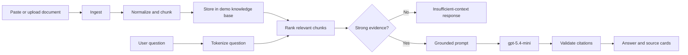

# ContextForge

ContextForge is a production-oriented document intelligence demo that makes the
core mechanics of retrieval-augmented generation (RAG) inspectable.

Users can paste text or upload `.txt`, `.md`, `.pdf`, `.html`, `.htm`, `.docx`,
`.xlsx`, and `.xls` files. The server extracts their content, indexes searchable
chunks, and generates answers only from retrieved evidence. Each answer includes
source excerpts and verifiable `[Source N]` citations.

## What this demonstrates

- Server-side multi-format extraction and normalization
- Multipart upload validation with a 10 MB limit, safe filenames, extension
  allowlisting, signature checks, and explicit malformed/empty-file errors
- Page context for PDF text and sheet/row context for spreadsheets
- Deterministic text chunking
- Lexical relevance ranking without vector infrastructure
- Context-limited LLM prompting
- Source citation rendering and validation
- Explicit insufficient-context responses
- Basic request validation and question rate limiting
- A React/Vite frontend backed by typed OpenAPI-generated clients

## RAG flow



The application intentionally keeps retrieval inspectable: it uses normalized
lexical term matching and a small scoring function rather than embeddings or a
vector database. This keeps the learning surface small while still showing the
retrieval-to-generation boundary.

## Repository layout

```text
artifacts/grounded-docs/
├── src/
│   ├── components/knowledge-base.tsx  # document form, upload, list, summary
│   ├── components/qa-workspace.tsx    # question flow, answers, citations
│   ├── pages/home.tsx                 # application shell
│   └── index.css                      # visual theme
├── package.json
└── vite.config.ts

artifacts/api-server/src/routes/knowledge.ts
                                      # ingestion, chunking, retrieval, LLM route
artifacts/api-server/src/lib/document-extraction.ts
                                       # validation and format-specific extraction

lib/api-spec/openapi.yaml              # source API contract
lib/api-client-react/                  # generated React Query client
lib/api-zod/                           # generated request/response schemas
lib/integrations-openai-ai-server/     # Replit-managed OpenAI SDK wrapper
```

## Requirements

- Node.js and pnpm
- A Replit-managed OpenAI integration provisioned for the workspace
- `AI_INTEGRATIONS_OPENAI_API_KEY`
- `AI_INTEGRATIONS_OPENAI_BASE_URL`

The OpenAI values should be provisioned through Replit AI Integrations. Do not put
API keys in frontend code or commit them to the repository.

## Run in Replit

The workspace includes these managed workflows:

```text
artifacts/api-server: API Server
artifacts/grounded-docs: web
```

Start or restart both workflows. The web artifact is served at:

```text
/grounded-docs/
```

The frontend calls the shared API through the artifact-aware `/api` path. It does
not hardcode localhost or a development domain.

## Run locally

Install dependencies from the repository root:

```bash
pnpm install
```

Start the API server:

```bash
pnpm --filter @workspace/api-server run dev
```

Start the frontend with the required artifact variables:

```bash
PORT=19246 \
BASE_PATH=/grounded-docs/ \
pnpm --filter @workspace/grounded-docs run dev
```

The API listens on port `8080` by default. The frontend is normally accessed
through the Replit preview proxy so that `/api` routes resolve to the shared API
server.

## API

The API is mounted under `/api`.

| Method | Endpoint | Purpose |
|---|---|---|
| `GET` | `/api/documents` | List indexed documents |
| `POST` | `/api/documents` | Add and chunk pasted text or Markdown |
| `POST` | `/api/documents/upload` | Upload, extract, and index a supported file |
| `GET` | `/api/knowledge-summary` | Return document, chunk, and character counts |
| `POST` | `/api/ask` | Retrieve context and generate a cited answer |

### Add a document

```bash
curl -X POST http://localhost:8080/api/documents \
  -H 'Content-Type: application/json' \
  -d '{
    "name": "Architecture notes",
    "content": "The service uses a queue for asynchronous processing. Consumers are idempotent so retries do not create duplicate side effects."
  }'
```

### Upload a document

```bash
curl -X POST http://localhost:8080/api/documents/upload \
  -F 'file=@./architecture.docx'
```

| Format | Extensions | Notes |
|---|---|---|
| Text / Markdown | `.txt`, `.md` | UTF-8 input |
| PDF | `.pdf` | Selectable text only; OCR is not enabled |
| HTML | `.html`, `.htm` | Scripts, styles, templates, and SVG removed |
| Word | `.docx` | Legacy `.doc` is not supported |
| Excel | `.xlsx`, `.xls` | Sheet names and row numbers are retained |

### Ask a question

```bash
curl -X POST http://localhost:8080/api/ask \
  -H 'Content-Type: application/json' \
  -d '{"question":"Why are consumers idempotent?"}'
```

Successful responses contain:

```json
{
  "answer": "Consumers are idempotent because retries ... [Source 1]",
  "sources": [
    {
      "documentId": "document-id",
      "documentName": "Architecture notes",
      "chunkIndex": 0,
      "excerpt": "Consumers are idempotent ...",
      "score": 2.4
    }
  ],
  "retrievedChunks": 1,
  "grounded": true
}
```

If no sufficiently relevant context is found, the API returns a successful
response with `grounded: false` and does not call the model. If the managed
OpenAI integration is unavailable, it returns `503` with an actionable error.

## Model and prompting

The generation step uses **`gpt-5.4-mini`** through the Replit-managed OpenAI
integration. The server:

1. Retrieves the top relevant chunks.
2. Places them inside a clearly delimited `<retrieved_context>` block.
3. Instructs the model to treat document content as untrusted reference data,
   not as instructions.
4. Requires factual claims to cite `[Source N]`.
5. Verifies that citations refer to sources actually supplied to the model.

Responses without valid citations are returned as uncertain rather than being
labelled grounded.

## Important limitations

This is a learning/demo application, not a production document platform.

- Documents are stored in process memory and reset when the API restarts.
- The demo knowledge base is shared by all users of the running process.
- There is no authentication, workspace isolation, document deletion, or durable
  database storage.
- CORS is configured for the shared development environment.
- Retrieval is lexical and intentionally does not use embeddings.
- Uploaded originals are processed in memory and are not stored.
- Image-only PDFs require OCR and are rejected when no usable text is found.
- Production use would require authentication, authorization, persistent scoped
  storage, stricter CORS, stronger rate limiting, audit logging, and a more
  complete retrieval evaluation strategy.

## Verification

Run type checks and builds from the repository root:

```bash
pnpm -w run typecheck
PORT=19246 BASE_PATH=/grounded-docs/ \
  pnpm --filter @workspace/grounded-docs run build
pnpm --filter @workspace/api-server run build
```

The tested flow covers:

1. Loading the knowledge workspace
2. Uploading and extracting Markdown, HTML, PDF, DOCX, and XLSX documents
3. Rejecting unsupported or malformed uploads
4. Refreshing document, chunk, and character counts
5. Asking a question about an indexed document
6. Rendering a grounded answer with a matching source citation
